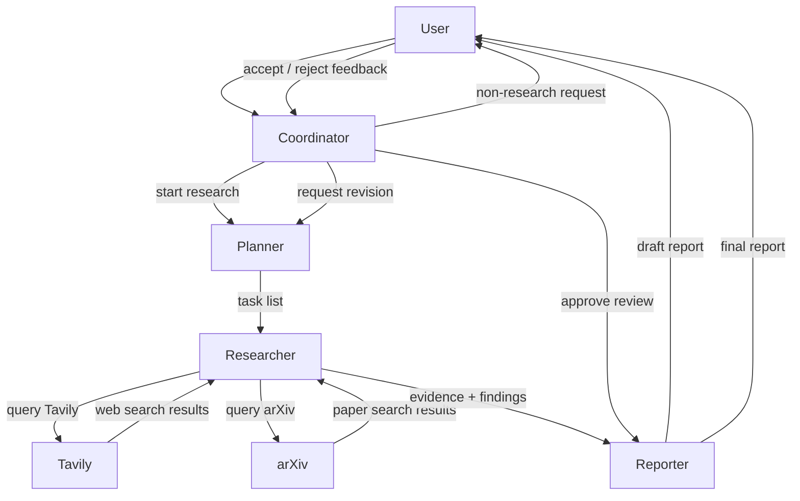
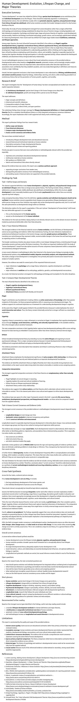

#  Multi-agent deep research system

A local multi-agent research system with a Ratatui-based terminal UI for orchestration, status monitoring, log inspection, and human review.

## Project Structure

```text
.
├── src/                               # The Ratatui terminal UI written in Rust
├── backend/
│   ├── app.py                        # FastAPI app export
│   ├── server.py                     # Python entry point used by the managed backend process
│   ├── service.py                    # Session endpoints, SSE publishing, and host-side workflow handling
│   ├── graph.py                      # LangGraph coordinator / planner / researcher / reporter graphs
│   ├── prompts.py                    # Prompt templates for coordinator, planner, researcher, reporter
│   ├── schemas.py                    # Typed graph state and runtime context
│   ├── settings.py                   # Loads .env configuration and typed runtime settings
│   ├── coordinator_host/
│   │   ├── memory.py                 # Session state, commands, and SSE event broker
│   │   ├── persistence.py            # Persists session logs and completed final reports under data/
│   │   ├── registry.py               # Tracks agent state snapshots for each session
│   │   └── worker_availability.py    # Tracks whether planner, researcher, and reporter are currently available
│   └── example.py                    # Standalone LangGraph example runner
├── .env                              # Runtime configuration for the backend
└── data/                             # Logs and generated reports created at runtime
```

## Backend Communication Model

At a high level, the system routes all user requests through the coordinator. The coordinator decides whether to reply directly, start a research workflow, or handle review feedback. Research tasks then flow through planner, researcher, and reporter, with the researcher calling Tavily and arXiv directly when it needs sources.

### Workflow and Communication



### What Happens in Each Case

#### 1. Non-research request

- The user sends a message to the coordinator.
- The system returns a direct coordinator reply.
- No planner, researcher, or reporter work is started.

#### 2. Start a research request

- The user sends a research query.
- The coordinator decides the request should enter research mode.
- The planner breaks the request into research tasks.
- The researcher executes those tasks and calls Tavily / arXiv to fetch sources.
- The researcher turns retrieved material into evidence and findings.
- The reporter converts that evidence into a draft report.
- The draft is returned to the user for review.

#### 3. Review feedback

- If the user approves the draft with `/accept`, the coordinator finalizes the report.
- The reporter finalizes the report and returns the final version to the user.
- If the user rejects the draft with `/reject`, the coordinator requests another pass.
- The planner starts a revised pass using the user's feedback.
- The workflow then repeats `planner -> researcher -> reporter` until a new draft is ready.

## Getting started

Python 3.10 or newer is recommended.

This project expects the virtual environment to live at `.venv` in the repository root, because the Rust frontend looks for:

`./.venv/bin/python`

If that path does not exist, the frontend cannot automatically start the local Python backend.


### Set Up the Python Environment

Run the following commands from the repository root:

```bash
python3 -m venv .venv
source .venv/bin/activate
pip install --upgrade pip
pip install -r requirements.txt
```

### Set Up the Rust Environment

If Rust is not installed yet, install `rustup` first:

```bash
curl --proto '=https' --tlsv1.2 -sSf https://sh.rustup.rs | sh
```

then install the stable toolchain:

```bash
rustup toolchain install stable
rustup default stable
rustc --version
cargo --version
```

Once Rust is installed, you can verify the project builds:

```bash
cargo build
```

### Configure Backend Environment Variables

Copy the example configuration first:

```bash
cp .env.example .env
```

Then edit `.env` as needed.

The most important variables are:

- `OPENAI_API_KEY`: Required. The system needs an LLM API key to run research workflows.
- `OPENAI_BASE_URL`: Defaults to the OpenAI API endpoint and usually does not need to be changed.
- `COORDINATOR_MODEL`: Optional. Defaults to `gpt-5.4-mini` and is used for brief/planning orchestration.
- `WORKER_MODEL`: Optional. Defaults to `gpt-5.4-mini` and is used for research/reporting work.
- `TAVILY_API_KEY`: Optional but recommended. The system can still run without it, but retrieval quality will be lower and arXiv rate limits will be more likely.
- `APP_HOST` / `APP_PORT`: The local backend bind address. The default is `127.0.0.1:8000`.

A minimal runnable configuration looks like this:

```env
OPENAI_API_KEY=your-api-key
OPENAI_BASE_URL=https://api.openai.com/v1
COORDINATOR_MODEL=gpt-5.4-mini
WORKER_MODEL=gpt-5.4-mini
TAVILY_API_KEY=
APP_HOST=127.0.0.1
APP_PORT=8000
```

### How to Run


After the Python environment, Rust toolchain, and `.env` file are ready, run this from the repository root:

```bash
cargo run
```

By default, this does the following:

- Starts the Rust terminal UI.
- Uses `./.venv/bin/python` to launch the Python backend automatically.
- Connects the frontend to `http://127.0.0.1:8000`.

If backend startup fails, check these first:

- Whether `.venv` exists.
- Whether `.venv/bin/python` is valid.
- Whether `.env` contains a valid `OPENAI_API_KEY`.
- Whether port `8000` is already in use.
- Whether `data/backend-host.log` contains startup errors.


## Usage

After startup, the terminal UI shows:

- The agent list
- The session status
- The event stream log
- The command input area

Built-in commands include:

- `/help`: Show help
- `/refresh`: Refresh session and agent status
- `/clear`: Clear the screen
- `/accept [text]`: Accept the report with optional feedback
- `/reject [text]`: Reject the report with optional feedback
- `/q`: Exit the program

Plain text input is sent as a user request to the currently selected agent if direct input is allowed.

The final report will be stored locally in `./data/reports/`

## Preview

### User interface


### Generated report


